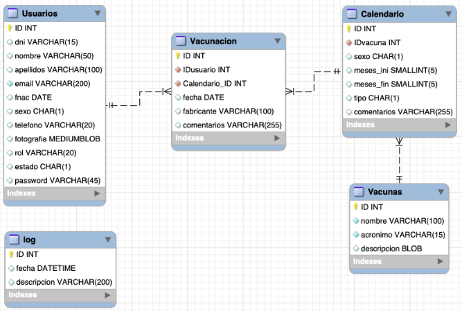

# Hospital-Marzor




**Proyecto final de la asignatura Tecnologías Web (2020-2021).**

Consistió en el desarrollo de una aplicación web sencilla pero suficientemente completa de manera que el resultado final sea totalmente funcional y comparable a cualquier aplicación web real. Para ello usé HTML, CSS, PHP, MYSQL.

## Detalles 📋
Aunque no tenga demo, el proyecto está realizado mediante MVC. Creé un sistema de rutas, controladores abstractos para separar por ejemplo el lenguaje de la base de datos del código (por si en un futuro se cambia el lenguaje del mismo), plantillas de vistas por ejemplo para crear etiquetas: 
```
HTMLTag_container('etiqueta','atributos',['elementos dentro de la etiqueta', 'otro container si quieres', ...]);
```

## Autor ✒️
**Jesús Martín Zorrilla** - *Trabajo Inicial y Documentación*

- [Portafolio](https://jesusmarzor.com)
- [Linkedin](https://www.linkedin.com/in/jesusmarzor/)

## Licencia 📄
Este proyecto está bajo la Licencia (GNU General Public License v3.0) - mira el archivo [LICENSE](LICENSE) para detalles
